PAV - P3: detección de pitch
============================

**Esta práctica se distribuye a través del repositorio GitHub [Práctica 3](https://github.com/albino-pav/P3).
Siga las instrucciones de la [Práctica 2](https://github.com/albino-pav/P2) para realizar un `fork` de la
misma y distribuir copias locales (*clones*) del mismo a los distintos integrantes del grupo de prácticas.**

**Recuerde realizar el *pull request* al repositorio original una vez completada la práctica.**

Ejercicios básicos
------------------

**- Complete el código de los ficheros necesarios para realizar la detección de pitch usando el programa get_pitch.**

   * **Complete el cálculo de la autocorrelación e inserte a continuación el código correspondiente.**


```c
void PitchAnalyzer::autocorrelation(const vector<float> &x, vector<float> &r) const {
     //FILE *autocorr = fopen("autocorr.txt","a");
    for (unsigned int l = 0; l < r.size(); ++l) {
  		// \TODO Compute the autocorrelation r[l]
      r[l] = 0;
        for(unsigned int n = 0; n < x.size() - l; n++){
          r[l]= x[n] * x[n+l] + r[l];
        }
        r[l]=(1.0F/x.size())*r[l];
        //fprintf(autocorr,"%f\n",r[l]);
       
      /// \DONE 
    }
     //fclose(autocorr); 
    if (r[0] == 0.0F) //to avoid log() and divide zero 
      r[0] = 1e-10; 
}

```

   * **Inserte una gŕafica donde, en un *subplot*, se vea con claridad la señal temporal de un segmento de unos 30 ms de 	un fonema sonoro y su periodo de pitch; y, en otro *subplot*, se vea con claridad la autocorrelación de la señal y 	  la posición del primer máximo secundario.**

	 **NOTA: es más que probable que tenga que usar Python, Octave/MATLAB u otro programa semejante para hacerlo. Se            valorará la utilización de la librería matplotlib de Python.**
	 
Hemos optado por hacer la gráfica en **Python**, concretamente con la librería **matplotlib**. La gráfica se corresponde a la señal y a la autocorrelación de un audio de *30ms*, y en ellas hemos remarcado el **periodo de pitch** y el primer máximo secundario. 

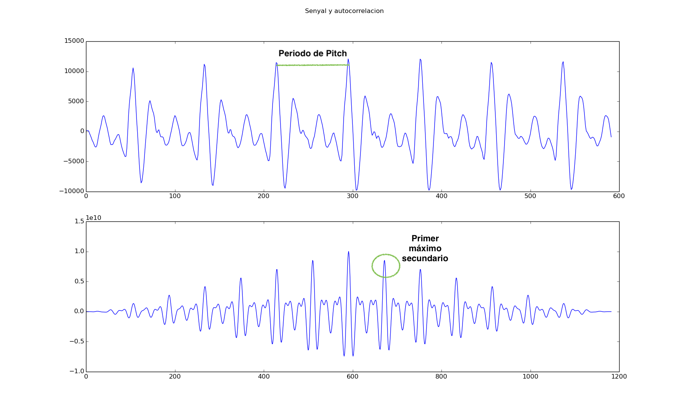

Tambien la hicimos en matlab:

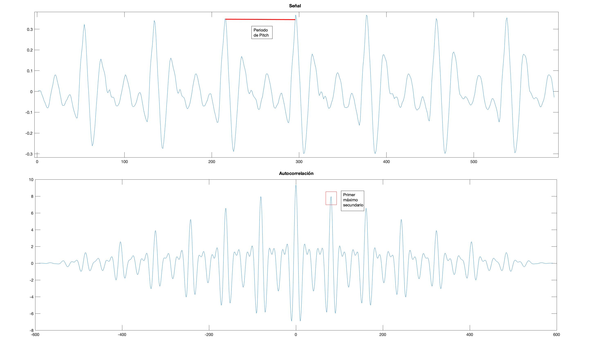

A continuación se muestra un audio de más duración:

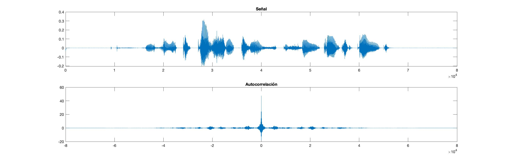

NOTA: los códigos se encuentran en la carpeta _pym_. 

   * **Determine el mejor candidato para el periodo de pitch localizando el primer máximo secundario de la autocorrelación. Inserte a continuación el código correspondiente.**
     
```c
while (*iR > 0 && iR < r.end()){
      iR++;
}

if(iR < r.begin() + npitch_min){ 
      iR = r.begin() + npitch_min;
}

iRMax = iR;
while(iR!=r.end()){
      if(*iR>*iRMax){
        iRMax=iR;
}
++iR;
```

   * **Implemente la regla de decisión sonoro o sordo e inserte el código correspondiente.**

```c
bool PitchAnalyzer::unvoiced(float pot, float r1norm, float rmaxnorm,float tasa) const {

    bool unvoiced = true;
    float potnorm=pot/potmaxima;
    //cout << potnorm << '\t' << pot << '\t' << potmaxima << endl;
    if(r1norm > umb1 || rmaxnorm > umb2 /*|| tasa < umb3*/){        //0.95 0.48   91,26%
      unvoiced = false;
    }
    if(tasa > umb3){   // 4200 91,26%
      unvoiced = true;
    }
    if(potnorm<2.5 && tasa<2450){      //2.5  2500   91,53
      unvoiced = false;
    }
    return unvoiced;
}
```

- **Una vez completados los puntos anteriores, dispondrá de una primera versión del detector de pitch. El resto del  	trabajo consiste, básicamente, en obtener las mejores prestaciones posibles con él.**

  * **Utilice el programa `wavesurfer` para analizar las condiciones apropiadas para determinar si un segmento es sonoro o sordo.**
	
	  - **Inserte una gráfica con la detección de pitch incorporada a `wavesurfer` y, junto a ella, los principales candidatos para determinar la sonoridad de la voz: el nivel de potencia de la señal (r[0]), la autocorrelación normalizada de uno (r1norm = r[1] / r[0]) y el valor de la autocorrelación en su máximo secundario (rmaxnorm = r[lag] / r[0]).**

**Puede considerar, también, la conveniencia de usar la tasa de cruces por cero.**
**Recuerde configurar los paneles de datos para que el desplazamiento de ventana sea el adecuado, que en esta práctica es de 15 ms.**

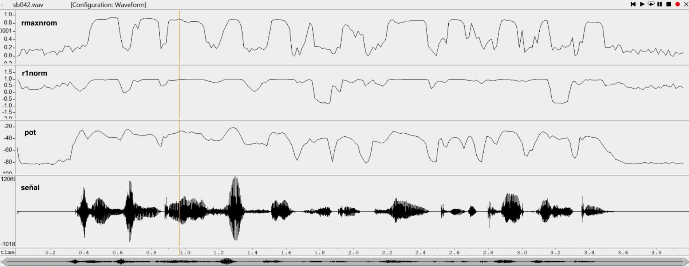


- **Use el detector de pitch implementado en el programa wavesurfer en una señal de prueba y compare su resultado con el obtenido por la mejor versión de su propio sistema.  Inserte una gráfica ilustrativa del resultado de ambos detectores.**

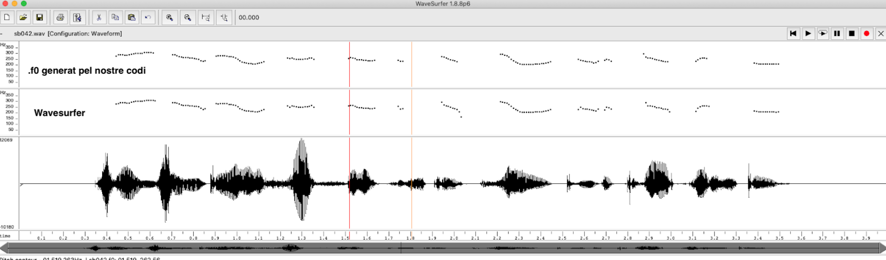

Otra forma de ver el resultado de nuestro código sería el siguiente (hemos usado otro audio):

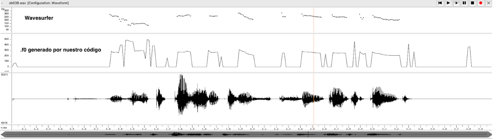
  
  
  * **Optimice los parámetros de su sistema de detección de pitch e inserte una tabla con las tasas de error y el *score* TOTAL proporcionados por `pitch_evaluate` en la evaluación de la base de datos `pitch_db/train`..**

Unvoiced frames as voiced | Voiced frames as unvoiced | Gross voiced error | MSE of fine errors |
------------------------- | ------------------------- | ------------------ | ------------------ |
218/7045 (3.09 %)|356/4155 (8.57 %)|70/3799 (1.84 %)|2.73 %| 

Resultado TOTAL |**91.54%**|


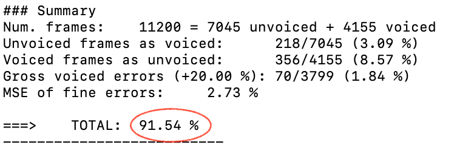

   * **Inserte una gráfica en la que se vea con claridad el resultado de su detector de pitch junto al del detector de Wavesurfer. Aunque puede usarse Wavesurfer para obtener la representación, se valorará el uso de alternativas de mayor calidad (particularmente Python).**
   
Hemos usado **Python**, y el resultado es el siguiente:

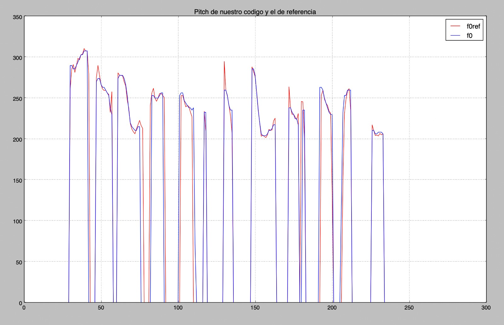


Ejercicios de ampliación
------------------------

- **Usando la librería `docopt_cpp`, modifique el fichero `get_pitch.cpp` para incorporar los parámetros del detector a   los argumentos de la línea de comandos.**
  
  **Esta técnica le resultará especialmente útil para optimizar los parámetros del detector. Recuerde que una parte importante de la evaluación recaerá en el resultado obtenido en la detección de pitch en la base de datos.**

  * **Inserte un *pantallazo* en el que se vea el mensaje de ayuda del programa y un ejemplo de utilización con los argumentos añadidos.**

Mensaje de ayuda del **docopt**:

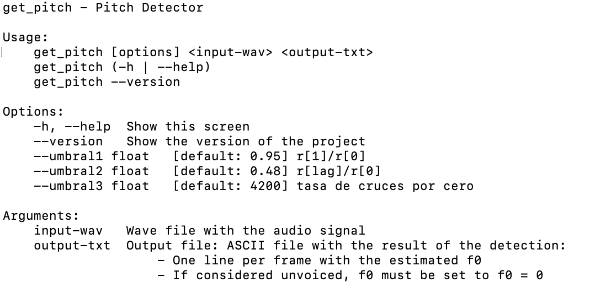

Ejemplo de uso:
 * Ejemplo 1: Sin definir umbrales (los por defecto)
 
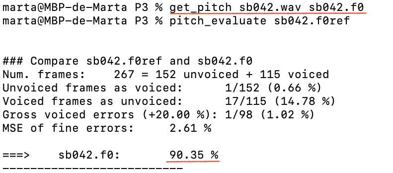


 * Ejemplo 2: Definiendo umbrales
 
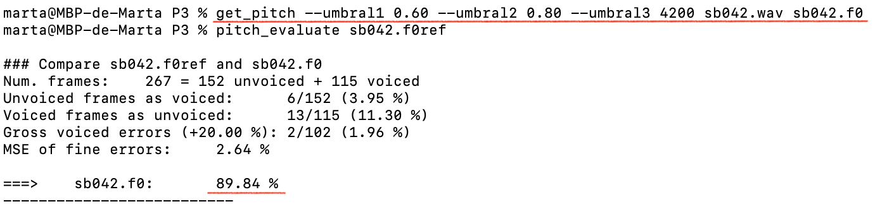

Gracias al docopt, tenemos un fácil y rápido acceso a modificar los valores de los umbrales. Aún así, quisimos provar de hacer un script en **bash**.

AÑADIR EL SCRIPT. 

- Implemente las técnicas que considere oportunas para optimizar las prestaciones del sistema de detección
  de pitch.

  Entre las posibles mejoras, puede escoger una o más de las siguientes:

  * Técnicas de preprocesado: filtrado paso bajo, *center clipping*, etc.
  * Técnicas de postprocesado: filtro de mediana, *dynamic time warping*, etc.
  * Métodos alternativos a la autocorrelación: procesado cepstral, *average magnitude difference function*
    (AMDF), etc.
  * Optimización **demostrable** de los parámetros que gobiernan el detector, en concreto, de los que
    gobiernan la decisión sonoro/sordo.
  * Cualquier otra técnica que se le pueda ocurrir o encuentre en la literatura.

  Encontrará más información acerca de estas técnicas en las [Transparencias del Curso](https://atenea.upc.edu/pluginfile.php/2908770/mod_resource/content/3/2b_PS%20Techniques.pdf)
  y en [Spoken Language Processing](https://discovery.upc.edu/iii/encore/record/C__Rb1233593?lang=cat).
  También encontrará más información en los anexos del enunciado de esta práctica.

  Incluya, a continuación, una explicación de las técnicas incorporadas al detector. Se valorará la
  inclusión de gráficas, tablas, código o cualquier otra cosa que ayude a comprender el trabajo realizado.

  También se valorará la realización de un estudio de los parámetros involucrados. Por ejemplo, si se opta
  por implementar el filtro de mediana, se valorará el análisis de los resultados obtenidos en función de
  la longitud del filtro.
   

Evaluación *ciega* del detector
-------------------------------

Antes de realizar el *pull request* debe asegurarse de que su repositorio contiene los ficheros necesarios
para compilar los programas correctamente ejecutando `make release`.

Con los ejecutables construidos de esta manera, los profesores de la asignatura procederán a evaluar el
detector con la parte de test de la base de datos (desconocida para los alumnos). Una parte importante de
la nota de la práctica recaerá en el resultado de esta evaluación.
